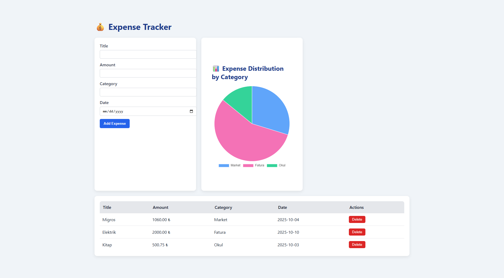

# 💸 Expense Tracker




A full-stack web application for managing personal income and expenses — built with **Spring Boot**, **PostgreSQL**, and **ReactJS**.  
It allows users to record their expenses, categorize them, and visualize spending distribution with interactive charts.


## 🚀 Live Demo
[Check it out here](https://expense-tracker-iota-hazel.vercel.app/)

---

## 🚀 Features

- Add, view, and delete expenses  
- Automatic category-based data visualization (Pie Chart)  
- Real-time frontend–backend synchronization  
- Form validation and clean UI built with TailwindCSS  
- RESTful API with Spring Boot + PostgreSQL backend  

---

## 🧱 Tech Stack

### Backend
- **Java 21+**
- **Spring Boot (Web, JPA, Validation)**
- **PostgreSQL**
- **Maven**

### Frontend
- **ReactJS (Hooks)**
- **Axios**
- **Chart.js + react-chartjs-2**
- **TailwindCSS**

---

## ⚙️ Setup Instructions

### 🖥️ Backend (Spring Boot)
```bash
# Navigate into backend folder
cd expense-tracker-backend

# Configure your PostgreSQL credentials in application.properties
spring.datasource.url=jdbc:postgresql://localhost:5432/expensetracker
spring.datasource.username=postgres
spring.datasource.password=yourpassword

# Run the Spring Boot server
mvn spring-boot:run
````
API runs on:
- 📡 http://localhost:8080/api/expenses

# Navigate into frontend folder
cd expense-tracker-frontend

# Install dependencies
npm install

# Run the app
npm start

Frontend runs on:
- 🌐 http://localhost:3000
## 📡 API Reference

| Method | Endpoint              | Description              |
|--------|-----------------------|--------------------------|
| GET    | `/api/expenses`       | Fetch all expenses       |
| POST   | `/api/expenses`       | Create a new expense     |
| DELETE | `/api/expenses/{id}`  | Delete an expense by ID  |

### Example request

```json
{
  "title": "Groceries",
  "amount": 120.5,
  "category": "Food",
  "date": "2025-10-04"
}
```
# Expense Tracker

## 📁 Project Structure
```
expense-tracker/
┣ backend/
┃ ┣ controller/
┃ ┣ model/
┃ ┣ repository/
┃ ┣ service/
┃ ┗ ExpenseTrackerApplication.java
┣ frontend/
┃ ┣ src/components/
┃ ┣ src/services/
┃ ┗ App.js
┗ README.md
```

## 🧑‍💻 Author

**Oğuzcan Karaman**  
📍 Ankara, Türkiye  
[LinkedIn](https://www.linkedin.com/in/oguzcankaraman/) • [GitHub](https://github.com/oguzcankaraman)
